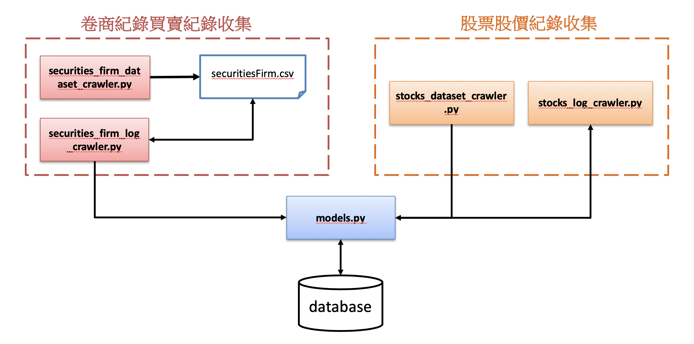

# 台股爬蟲&分析

> 如上圖，簡單介紹流程，主要分成2塊，卷商紀錄買賣紀錄收集、股票股價紀錄收集，其中各自含 2 隻爬蟲，用意都是優先抓取初始清單，並利用初始清單抓取紀錄檔，其中除了 TWSE 股票每天紀錄資訊其他皆為動態網頁，請自行找好 webdriver 把路徑加入設定檔，上面的 securitiesFirm.csv
卷商清單，目前已改成直接存取資料庫，在存取資料庫部份實作了 ORM ，Table 會自行生成，只要自己指定好 Database 就好，最後分析部分還在實驗測試階段暫不上傳，請自行找演算法分析測試。

# 內容物包含
### securities_firm_dataset_crawler.py

  - 自動化擷取卷商初始資料集
 
### securitiesFirm.csv

  - 卷商資料集，目前版本為直接進Db
  
### securities_firm_log_crawler.py

  - 自動化擷取卷商買賣紀錄

### stocks_dataset_crawler.py
 
   - 自動化擷取 TWSE 股票資訊，可自由選擇上櫃、上市等

### stocks_log_crawler.py
 
   - 自動化擷取 TWSE 股票每天紀錄資訊
   
### models.py

   - 實作 sqlalchemy ， 目前採用 Mysql 做 ORM 
    
### config.ini
    
   - 設定檔，可自由調整爬蟲抓取的時間區間等
 
### user-agent.txt

   - 用戶代理清單，讓你偽裝各種平板手機電腦用的，目前僅剩各種電腦清單